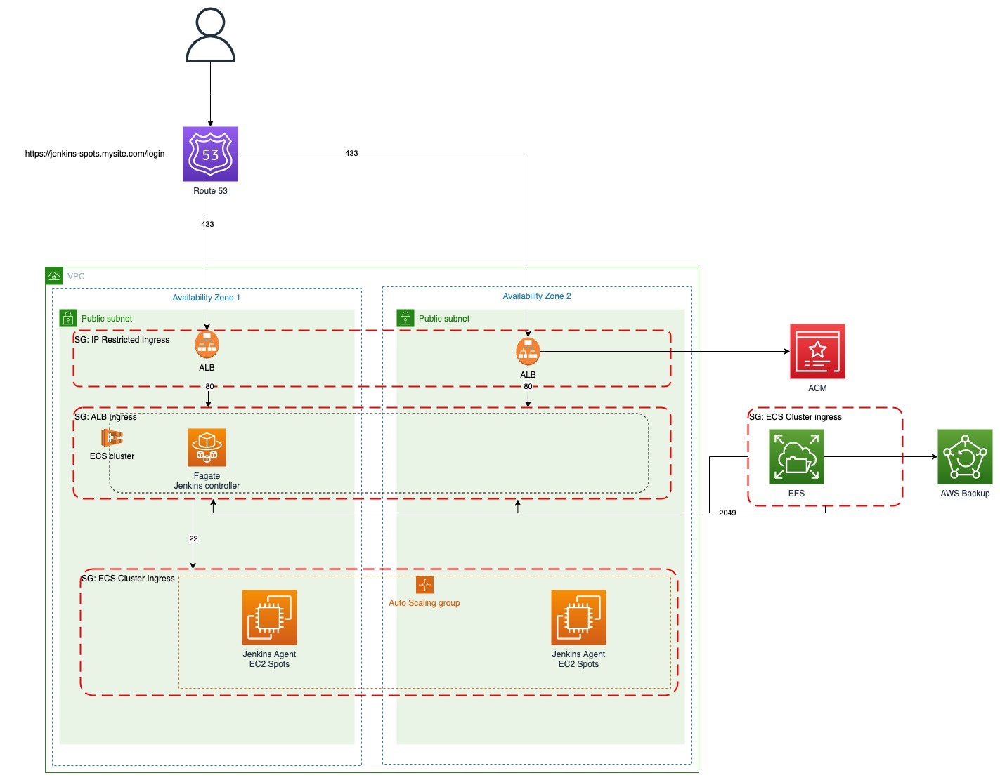

## Jenkins setup with Controller running in ECS Fargate, Agents running on spot fleet
Needs work:
-AMI's for Java/jenkins for EC2 instances. Need to get ssm param with Java instances.
-Needs refining of Instance profile IMA. aws_iam_policy_document.ec2_spotfleet_policy_doc
ssh keys for Jenkins plugin? how to create and store private key securely

## Prerequisites
The following are required to deploy this Terraform module

1. Valid SSL certificate ARN matching on the domain name alias which you intend to use ie "jenkins.mywebsite.com".
2. AWS created SSH private key. The private part of this is used by the Jenkins spot fleet plugin to launch and comminicate with worked agents which use the public portion
3. VPC with at least 2 public subnets and DNS hostnames and DNS Resolution activated.
4. Existing domain name registered in route53 eg "mywebsite.com"
5. Terraform must be bootstrapped. This means that a state S3 bucket and a state locking DynamoDB table must be initialized.

##  Rescources created
* Service discovery for ECS
* ALB
* ECS Cluster and service
* Fargate Task
* IAM Policies and roles
* Cloudwatch log group
* Fargate Task Definition
* Route 53 record with alias to ALB
* Security groups
* backup
* EFS

## Module Variables

| Variable  | Description | Type | Default | Required |
| ---      |  ------  |----------|----------|----------|
| `domain_name` | Existing domain record already setup in route53 | `string` | na  | `Yes`|
| `route53_subdomain` | subdomain name which API gateway will use for custom domain setup. Needs to match the ACM SSL | `string` | na  | `Yes`|
| `alb_acm_certificate_arn` | The ACM certificate ARN to use for the ALB fronting the site | `string` | na  | `Yes`|
| `region` | AWS region to deploy resources | `string` | `eu-west-2`  | `Yes`|
| `alb_ingress_allow_cidrs` | list of IP cidr ranges to lockdown the ALB access | `stringlist` | na  | `Yes`|
| `name_prefix` | name prefix to be used for project and all resources  | `string` | `Jenkins-spotfleet`  | `Yes`|
| `vpc_id` | id of existing VPC. This needs at least 2 public subnets with routing  | `string` | na  | `Yes`|
| `image` | Jenkins Docker image url  | `string` | `jenkins/jenkins:lts-jdk11` | `Yes`|
| `spot_fleet_ami` | AMI image to use with Java already installed  | `string` | `jenkins/jenkins:lts-jdk11` | `Yes`|
| `instance-type` | List of instance type to use for Spot instances   | `string list` | `t3.medium", "t3.large", "t2.medium", "t2.large", "t3a.medium", "t3a.large` | `Yes`|
| `sshkey` | Name of existing SSH private key in aws to use for the EC2 Spot Fleet Jenkins plugin to use to manage spot instance  | `string` | na | `Yes`|
| `controller_cpu` | The amount of CPU to dedicate to the Jenkins fargate task. This must be one of the accepted Fargate [options](https://docs.aws.amazon.com/AmazonECS/latest/developerguide/task-cpu-memory-error.html).| `number` | `512` | `Yes`|
| `controller_memory` | The amount of memory to dedicate to the fargate task. This must be one of the accepted Fargate [options](https://docs.aws.amazon.com/AmazonECS/latest/developerguide/task-cpu-memory-error.html).| `number` | `1024` | `Yes`|
| `default_tags` | A mapping set of tags available to set on resources | `map(string)` | `Terraform = "true"  | `Yes`|
| `jenkins_controller_task_role_arn` | Custom Fargate Task role for Jenkins controller to use   | `string` | na | `No`|
| `ecs_execution_role_arn` | Custom fargate task exection role for to be used on Fargate Task  | `string` | na | `No`|
| `controller_port` | Port number for Jenkins Fargate Controller webUI task to expose  | `number` | `8080' | `Yes`|
| `agent_port` | Port number for Jenkins Fargate Task to register on service discovery   | `number` | `5000` | `Yes`|????
| `ALB_port` | Jenkins Docker image url  | `string` | `default` | `Yes`|??
| `efs_enable_encryption` | Set Encyrption for EFS volume  | `Bollean` | `true` | `Yes`|
| `efs_kms_key_arn` | KMS Encyrption key to use. Defaults to EFS Managed  | `string` | `null` | `no`|
| `efs_performance_mode` | The EFS performance/billing mode. Can be `generalPurpose` or `maxIO`. | `string` | `generalPurpose` | `Yes`|
| `efs_throughput_mode` | The EFS throughput/billing mode. Can be `bursting` or `provisioned`. | `string` | `bursting` | `Yes`|
| `efs_provisioned_throughput_in_mibps` | The EFS provisioned throughput value in MiBps. Only applicable if `efs_throughput_mode` is `provisioned`. | `number` | `None` | `No`|
| `efs_ia_lifecycle_policy` | The EFS lifecycle management policy for infrequent access files. See the [docs](https://docs.aws.amazon.com/efs/latest/ug/lifecycle-management-efs.html) for values. | `string` | `None` | `No`|
| `efs_access_point_uid` | The POSIX UID to associate with the EFS filesystem endpoint. This must match the jenkins user UID to enable writing to the fileystem | `number` | `1000` | `Yes`|
| `efs_access_point_gid` | The POSIX GID to associate with the EFS filesystem endpoint. This must match the jenkins user GID to enable writing to the fileystem | `number` | `1000` | `Yes`|
| `efs_enable_backup` | Should backups of EFS be enabled using AWS Backup? | `bool` | `true` | `Yes`|
| `efs_backup_schedule` | An AWS Cron string defining the backup schedule for the EFS Fileystem. | `string` | `cron(0 00 * * ? *)` | `Yes`|
| `efs_backup_start_window` | The amount of grace time in minutes given to the backup job in order to start. If the job does not within this period it will be canceled. | `number` | `60` | `Yes`|
| `efs_backup_completion_window` | The amount of time in minutes that the backup has to complete. If the backup job is not completed within this period it will be canceled. | `number` | `120` | `Yes`|
| `efs_backup_cold_storage_after_days` | The number of days before old backups are moved to cold storage. | `number` | `30` | `No`|
| `efs_backup_delete_after_days` | The number of days before old backups are Deleted. If cold storage transition is enabled then this number must be greater than `90`. | `number` | `120` | `No`|
| `alb_type_internal` | Should the ALB be of type `internal`. If internal, access to the Jenkins UI will be restricted such that it is accessible only from the VPC. | `bool` | `false` | `Yes`|
| `alb_enable_access_logs` | Should access logging be enabled on the ALB.  | `bool` | `false` | `Yes`|
| `alb_access_logs_bucket_name` | The S3 bucket where ALB access logs are sent if `alb_enable_access_logs` is `true`. This bucket and its policy must already be setup according to the [docs](https://docs.aws.amazon.com/elasticloadbalancing/latest/application/load-balancer-access-logs.html) | `string` | `None` | `No`|
| `alb_access_logs_s3_prefix` | S3 object prefix for ALB access logs if enabled | `string` | `None` | `No`|
